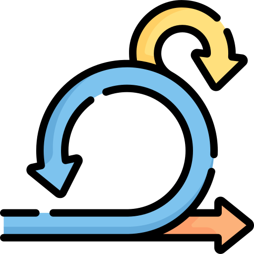

# 2.5 Projektmethode

Wie bereits in den früheren Semesterarbeiten, wird für diese Arbeit KanBan genutzt, zusammen mit einem Scrum Ansatz.
Das ganze wird möglichst agil, also wenig einschneidend und dynamisch angewendet.

## Kanban

Kanban ist eine agile Methode im Projektmanagement, die auf der Sichtbarmachung von Arbeitsabläufen basiert. Dabei werden Karten verwendet, um die anstehenden Aufgaben und den Fortschritt darzustellen. Diese Methode hilft Teams, ihre Arbeit zu organisieren, zu sehen und zu verbessern, indem sie den Arbeitsfluss steuern und Überlastung vermeiden.

Kanban-Boards machen den aktuellen Stand der Arbeit sichtbar. So können Engpässe erkannt und Verbesserungsmöglichkeiten aufgedeckt werden. Kanban fördert außerdem die Zusammenarbeit im Team und sorgt für eine ständige Verbesserung des Arbeitsprozesses. Interessanterweise eignet sich Kanban auch gut für kleine Projekte, die von wenigen oder sogar einzelnen Personen durchgeführt werden.

{: width="250px" }

[Quelle Bild - Icons](../anhang/600-quellen.html#64-icons)

## Scrum

Scrum ist eine Projektmanagement Methode. Sie zeichnet sich durch effiziente Abläufe, schrittweise Entwicklung und regelmäßiges Feedback aus. Ursprünglich wurde Scrum für die Softwareentwicklung entwickelt, wird aber inzwischen in verschiedenen Bereichen genutzt.

Der Kern von Scrum ist ein schrittweiser Ansatz, bei dem das Produkt in kleinen Verbesserungen entwickelt wird. Dazu gibt es wiederholte Arbeitsphasen, sogenannte Sprints, in denen verschiedene Versionen des Produkts entstehen. Diese Sprints werden so lange wiederholt, bis ein zufriedenstellendes und vollständiges Produkt erreicht ist.

{: width="250px" }

[Quelle Bild - Icons](../anhang/600-quellen.html#64-icons)

## Kanban und Scrum in meiner Semesterarbeit

Während der Semesterarbeit wird mit den Projektmanagement-Methoden Kanban und Scrum gearbeitet. Kanban ist bereits in GitHub integriert, wo man Boards und Tasks selbst erstellen kann. So sind in Form von "Issues", noch anstehende Aufgaben aufgelistet, die erledigt werden müssen. Jeder Developer kann sich diese "Issues" zuweisen und daran arbeiten.

Mit Kanban kann sehr effizient der Fortschritt kontinuierlich verfolgt werden, und es ist klar ersichtlich welcher Developer an welchen "Issues" arbeitet. Dazu werden vier Status bereitgestellt:

* Backlog, noch offene Arbeiten ohne zugewiesenen Entwickler.
* In Progress, offene Arbeiten, welche aber bereits von einem Entwickler zugewiesen worden sind. Der Verlauf der Arbeiten wird mit "Comments" dokumentiert.
* In Testing, diese Tasks müssen noch manuell von einem zweiten Developer getestet / abgenommen werden.
* Done, erledigte Arbeiten.

In GitHub-Projekten können verschiedene Ansichten für Kanban erstellt werden. So wurden verschiedene Gantt-Diagramme erstellt, um den gesamten Projektfortschritt zu verfolgen und zu überprüfen. Um die Arbeit voranzutreiben, wird man mit Scrum-Sprints arbeiten. Mit diesen Sprints werden die Zwischenziele ausgewertet und in den Sprintabschlüssen können die Entwickler ihre Erkentnisse des letzten Sprints erwähnen. Während der Semesterarbeit sind insgesamt 4 Sprints geplant.

Hier findet man den Link zum Projektmanagement:

[Projektplanung](https://github.com/users/Euthal02/projects/5)
