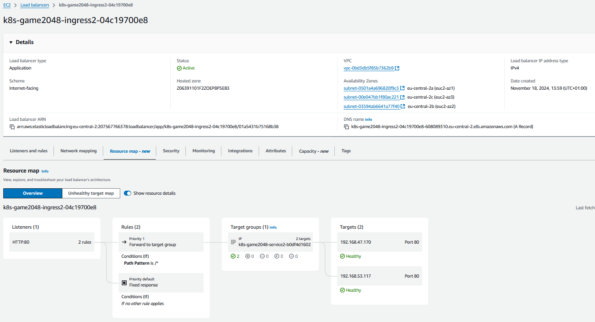

# 3.5 AWS Loadbalancer mit Kubernetes Ingress

Von Seite AWS wird vorgeschlagen, ihren Loadbalancer als Ingress für Kubernetes zu verwenden.
Wir greifen gerne auf diese Möglichkeit zurück. Dazu gibt es eine sehr detailierte Anleitung.

Diese ist unter diesem Link zu finden:
<https://docs.aws.amazon.com/eks/latest/userguide/aws-load-balancer-controller.html>

Das ganze ist auch bereits in dem Build Script integriert, so dass dieser Schritt nicht mehr manuell auszuführen ist.

Sollte dies trotzdem der Fall sein, werden hier die Schritte erklärt und die Beweggründe dahinter.

----

Zuerst einmal muss eine neue IAM Rolle erstellt werde.
Dies aus dem Grund, dass der Kubernetes Cluster bei einem Ingress Deployment, selbstständig neue Ressourcen generieren muss. Die benötigten Rechte bekommt man mit dem IAM Service Account.

## IAM User erstellen

AWS bietet hier eine Vorlage, welche man 1 zu 1 kopieren kann. Sie erlaubt dem Cluster alle Ressourcen zu erstellen welche er braucht. Mehr Informationen findet man im Code Fenster.

```bash
mka@Tuxedo-Laptop:~$ curl -O https://raw.githubusercontent.com/kubernetes-sigs/aws-load-balancer-controller/v2.7.2/docs/install/iam_policy.json
  % Total    % Received % Xferd  Average Speed   Time    Time     Time  Current
                                 Dload  Upload   Total   Spent    Left  Speed
100  8446  100  8446    0     0  22907      0 --:--:-- --:--:-- --:--:-- 22951
mka@Tuxedo-Laptop:~$ aws iam create-policy --policy-name AWSLoadBalancerControllerIAMPolicy --policy-document file://iam_policy.json
{
    "Policy": {
        "PolicyName": "AWSLoadBalancerControllerIAMPolicy",
        ......,
        "CreateDate": "2024-11-15T18:44:55+00:00"
    }
}
mka@Tuxedo-Laptop:~$ cat iam_policy.json
{
    "Version": "2012-10-17",
    "Statement": [
        {
            "Effect": "Allow",
            "Action": [
                "iam:CreateServiceLinkedRole"
            ],
            "Resource": "*",
            "Condition": {
                "StringEquals": {
                    "iam:AWSServiceName": "elasticloadbalancing.amazonaws.com"
                }
            }
        },
        ......,
}
mka@Tuxedo-Laptop:~$ eksctl create iamserviceaccount --cluster=eks-cluster --namespace=kube-system --name=aws-load-balancer-controller --role-name AmazonEKSLoadBalancerControllerRole --attach-policy-arn=arn:aws:iam::*********:policy/AWSLoadBalancerControllerIAMPolicy --approve
2024-11-25 20:58:34 [ℹ]  1 iamserviceaccount (kube-system/aws-load-balancer-controller) was included (based on the include/exclude rules)
2024-11-25 20:58:34 [!]  serviceaccounts that exist in Kubernetes will be excluded, use --override-existing-serviceaccounts to override
2024-11-25 20:58:34 [ℹ]  1 task: {
    2 sequential sub-tasks: {
        create IAM role for serviceaccount "kube-system/aws-load-balancer-controller",
        create serviceaccount "kube-system/aws-load-balancer-controller",
    } }2024-11-25 20:58:34 [ℹ]  building iamserviceaccount stack "eksctl-eks-cluster-addon-iamserviceaccount-kube-system-aws-load-balancer-controller"
2024-11-25 20:58:34 [ℹ]  deploying stack "eksctl-eks-cluster-addon-iamserviceaccount-kube-system-aws-load-balancer-controller"
2024-11-25 20:58:34 [ℹ]  waiting for CloudFormation stack "eksctl-eks-cluster-addon-iamserviceaccount-kube-system-aws-load-balancer-controller"
2024-11-25 20:59:05 [ℹ]  waiting for CloudFormation stack "eksctl-eks-cluster-addon-iamserviceaccount-kube-system-aws-load-balancer-controller"
2024-11-25 20:59:05 [ℹ]  created serviceaccount "kube-system/aws-load-balancer-controller"
```

Auf Seiten AWS ist nun also alles bereit, damit der Cluster die Ressourcen erstellen kann.
Als nächstes müssen wir den Cluster dementsprechend konfigurieren.

## HELM Install on Cluster

AWS bietet auch dazu einen einfachen Weg an, dies mit einem HELM Chart zu erledigen.

```bash
mka@Tuxedo-Laptop:~$ helm repo add eks https://aws.github.io/eks-charts
"eks" has been added to your repositories
mka@Tuxedo-Laptop:~$ helm install aws-load-balancer-controller eks/aws-load-balancer-controller -n kube-system --set clusterName=eks-cluster --set serviceAccount.create=false --set serviceAccount.name=aws-load-balancer-controller
NAME: aws-load-balancer-controller
LAST DEPLOYED: Fri Nov 15 19:50:55 2024
NAMESPACE: kube-system
STATUS: deployed
REVISION: 1
TEST SUITE: None
NOTES:
AWS Load Balancer controller installed!
mka@Tuxedo-Laptop:~$ wget https://raw.githubusercontent.com/aws/eks-charts/master/stable/aws-load-balancer-controller/crds/crds.yaml
--2024-11-25 21:01:26--  https://raw.githubusercontent.com/aws/eks-charts/master/stable/aws-load-balancer-controller/crds/crds.yaml
Resolving raw.githubusercontent.com (raw.githubusercontent.com)... 185.199.111.133, 185.199.110.133, 185.199.108.133, ...
Connecting to raw.githubusercontent.com (raw.githubusercontent.com)|185.199.111.133|:443... connected.
HTTP request sent, awaiting response... 200 OK
Length: 29410 (29K) [text/plain]
Saving to: ‘crds.yaml’

crds.yaml                                            100%[=====================================================================================================================>]  28.72K  --.-KB/s    in 0.006s

2024-11-25 21:01:26 (4.91 MB/s) - ‘crds.yaml’ saved [29410/29410]

mka@Tuxedo-Laptop:~$ kubectl apply -f crds.yaml
customresourcedefinition.apiextensions.k8s.io/ingressclassparams.elbv2.k8s.aws configured
customresourcedefinition.apiextensions.k8s.io/targetgroupbindings.elbv2.k8s.aws configured
```

## Test Applikation

Um zu testen ob dies auch wirklich funktioniert bietet sich eine kleine Testapplikation an.

```bash
mka@Tuxedo-Laptop:~$ kubectl apply -f https://raw.githubusercontent.com/kubernetes-sigs/aws-load-balancer-controller/v2.7.2/docs/examples/2048/2048_full.yaml
namespace/game-2048 created
deployment.apps/deployment-2048 created
service/service-2048 created
ingress.networking.k8s.io/ingress-2048 created
mka@Tuxedo-Laptop:~$ kubectl get ingress/ingress-2048 -n game-2048
NAME           CLASS   HOSTS   ADDRESS                                                                      PORTS   AGE
ingress-2048   alb     *       k8s-game2048-ingress2-04c19700e8-1901553064.eu-central-2.elb.amazonaws.com   80      15s
```

Dies erstellt einen Loadbalancer, welcher den Traffic auf der URl weiterleitet an die Nodes.

<http://k8s-game2048-ingress2-04c19700e8-608089310.eu-central-2.elb.amazonaws.com/>



Wenn wir die URL des Loadbalancers in einem Browser aufrufen, ist der Service direkt verfügbar.


Das Deployment dieses Spiel ist dabei sehr einfach.

```yaml
---
apiVersion: v1
kind: Namespace
metadata:
  name: game-2048
---
apiVersion: apps/v1
kind: Deployment
metadata:
  namespace: game-2048
  name: deployment-2048
spec:
  selector:
    matchLabels:
      app.kubernetes.io/name: app-2048
  replicas: 2
  template:
    metadata:
      labels:
        app.kubernetes.io/name: app-2048
    spec:
      containers:
      - image: public.ecr.aws/l6m2t8p7/docker-2048:latest
        imagePullPolicy: Always
        name: app-2048
        ports:
        - containerPort: 80
---
apiVersion: v1
kind: Service
metadata:
  namespace: game-2048
  name: service-2048
spec:
  ports:
    - port: 80
      targetPort: 80
      protocol: TCP
  type: NodePort
  selector:
    app.kubernetes.io/name: app-2048
---
apiVersion: networking.k8s.io/v1
kind: Ingress
metadata:
  namespace: game-2048
  name: ingress-2048
  annotations:
    alb.ingress.kubernetes.io/scheme: internet-facing
    alb.ingress.kubernetes.io/target-type: ip
spec:
  ingressClassName: alb
  rules:
    - http:
        paths:
        - path: /
          pathType: Prefix
          backend:
            service:
              name: service-2048
              port:
                number: 80
```
