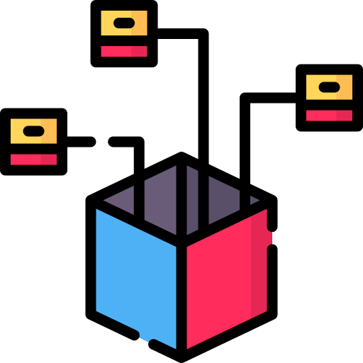

# 3.6 HELM Deployment

{: width="250px" }

[Quelle Bild - Icons](../anhang/600-quellen.html#64-icons)

Um nun den GameRoom und die GameLobby auf den Cluster zu bringen, wurden pro Image ein eigenes Helm Chart geschrieben:

* <https://github.com/Euthal02/SemArb4_GameLobby/tree/main/gamelobby/helm>
* <https://github.com/Euthal02/SemArb4_GameLobby/tree/main/gameroom/helm>

Das values File beinhaltet all Variablen, welche wir im Chart verwenden. Sie ist natürlich für die Lobby und den Room unterschiedlich.

```yaml
#file: values.yaml
namespace: pong-game-lobby

lobby:
  replicaCount: 1

  image:
    repository: ghcr.io/euthal02/pong-gamelobby
    tag: latest
    pullPolicy: Always

  service:
    port: 80
    targetport: 80
    protocol: TCP
    type: NodePort

  ingress:
    enabled: true
    className: alb
    annotations:
      alb.ingress.kubernetes.io/scheme: internet-facing
      alb.ingress.kubernetes.io/target-type: ip
      alb.ingress.kubernetes.io/backend-protocol: HTTP
      alb.ingress.kubernetes.io/healthcheck-protocol: HTTP
      alb.ingress.kubernetes.io/healthcheck-path: /health
      alb.ingress.kubernetes.io/load-balancer-attributes: 'idle_timeout.timeout_seconds=3600'
      external-dns.alpha.kubernetes.io/hostname: lobby.semesterarbeit.com
    tls: 
      enabled: false
      secretName: ""
```

Für jedes Deployment in unserem Cluster möchten wir einen neuen Namespace erstellen. Dasselbe gilt auch für den GameRoom und die GameLobby. Wie man in diesem Value File sehen kann, nutzen wir den Namespace ``pong-game-lobby``. Für den Gameroom wäre es dementsprechend ``pong-game-room``.

Wichtig hervorzuheben sind die ingress und external-dns Attribute. Mit Ihnen werden die [Plugins](./305-k8s-plugins.html) konfiguriert. Alle Werte entsprechen einer Config Option des ALB oder des external-dns Plugins. Hier zum Beispiel wird der ALB öffentlich erreichbar konfiguriert und ein Healthcheck konfiguriert.

```yaml
alb.ingress.kubernetes.io/scheme: internet-facing
alb.ingress.kubernetes.io/target-type: ip
alb.ingress.kubernetes.io/backend-protocol: HTTP
alb.ingress.kubernetes.io/healthcheck-protocol: HTTP
alb.ingress.kubernetes.io/healthcheck-path: /health
alb.ingress.kubernetes.io/load-balancer-attributes: 'idle_timeout.timeout_seconds=3600'
```

Und dem external-dns Plugin wird hiermit mitgeteilt, dass dieser Ingress den folgenden FQDN erhalten sollte.

```yaml
external-dns.alpha.kubernetes.io/hostname: lobby.semesterarbeit.com
```

Die Variablen aus dem Value File werden anschliessend in den eigentlichen Konfigurationsfile verwendet.

Zum Beispiel bei den Services. Hier wir zum Beispiel die GameLobby erstellt.

```yaml
apiVersion: v1
kind: Service
metadata:
  namespace: {{ .Values.namespace }}
  name: "{{ .Release.Name }}"
  labels:
    app: "{{ .Release.Name }}"
spec:
  type: {{ .Values.lobby.service.type }}
  ports:
  - port: {{ .Values.lobby.service.port }}
    targetPort: {{ .Values.lobby.service.targetport }}
    protocol: {{ .Values.lobby.service.protocol }}
  selector:
    app: "{{ .Release.Name }}"
```

Für die einzelnen Rooms funktioniert es genau gleich, wir verwenden jedoch einen Loop um die Massenerstellung zu erleichtern.

```yaml
{{- $ingressCount := .Values.room.ingressCount | int }}
{{- range $i := until $ingressCount }}
gleicheconfig: wie vorhin
---
{{- end }}
```

Die Menge der Rooms wird über die Variable ``.Values.room.ingressCount`` gesteuert, welche auch über das Values File definiert wird. Momentan ist dies also das 10-fache.
